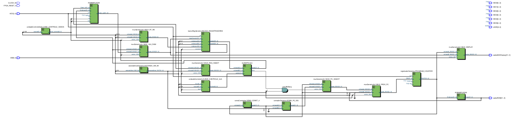
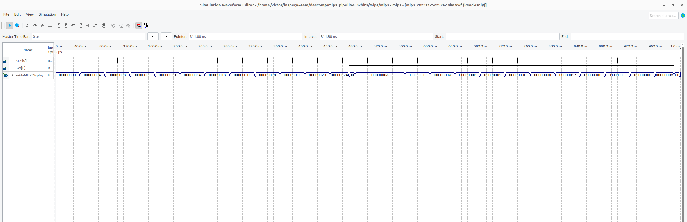

# mips_pipeline_32bits

## 1. Introduction

This project is a 5-stage pipeline MIPS CPU, which is implemented in VHDL. The CPU supports 18 MIPS instructions, including 32 general purpose registers, 32-bit ALU, 32-bit PC, 32-bit data memory, and 32-bit instruction memory. The CPU is tested by running a MIPS assembly program.

## 2. Instructions

TBD

## 3. RTL Viewer

## 4. Simulation

